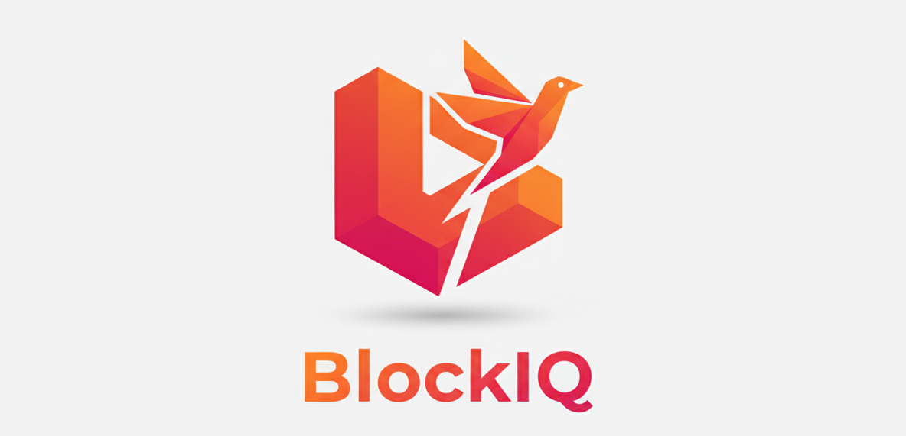

# BlockIQ

Advanced Stacks blockchain analytics platform powered by AI agents and the ADK-TS framework. BlockIQ transforms complex blockchain data into natural conversations and interactive visualizations, making the Bitcoin economy accessible to everyone.

## Important Note

BlockIQ currently operates on the Stacks Blockchain Testnet for demonstration and development purposes. The MCP server connects to the Stacks Testnet API (api.testnet.hiro.so) to fetch wallet data, transactions, and blockchain information. This allows for safe testing and experimentation without affecting mainnet assets. The architecture is designed to seamlessly switch to mainnet by simply updating the API endpoint configuration when ready for production deployment.

## What is BlockIQ?

BlockIQ is an intelligent blockchain analytics platform that allows users to analyze Blockchain wallet data through natural language conversations. Instead of struggling with raw blockchain explorers or writing complex queries, users can simply ask questions and receive intelligent, contextual answers with beautiful visualizations.

The platform leverages the ADK-TS (Agent Development Kit for TypeScript) framework to orchestrate multiple AI agents, each specialized for different types of blockchain analysis. Combined with a custom Model Context Protocol (MCP) server, BlockIQ provides unprecedented access to blockchain data through conversational AI.

## Core Technologies

### ADK-TS Framework Integration

BlockIQ is built on the ADK-TS framework, which provides the foundation for our multi-agent AI system. The framework enables:

- Agent orchestration and lifecycle management
- Seamless integration with multiple AI providers (OpenAI, Google, Anthropic, Groq, Hugging Face)
- Built-in MCP (Model Context Protocol) support for tool calling
- Automatic error handling and retry mechanisms
- Conversation state management

The ADK integration is implemented in `src/lib/adk-framework-integration.ts`, which creates a specialized BlockIQ agent with:

- Custom instructions for blockchain analysis
- MCP tool integration for data fetching
- Provider-agnostic model configuration
- Smart caching and health monitoring

### AI Models and Providers

BlockIQ supports multiple AI providers through ADK-TS:

- OpenAI: GPT-4, GPT-4 Turbo, GPT-3.5 Turbo
- Google: Gemini Pro, Gemini 1.5 Pro
- Anthropic: Claude 3 Opus, Claude 3 Sonnet, Claude 3 Haiku
- Groq: Llama 3, Mixtral models
- Hugging Face: Various open-source models

Users can configure their preferred provider and model through the settings interface. The system includes automatic model name normalization to handle provider-specific naming conventions.

### Model Context Protocol (MCP) Server

BlockIQ implements a custom MCP server (`src/mcp/blockiq-mcp-server.js`) that exposes specialized blockchain analysis tools to the AI agent. This server follows the official MCP specification and provides:

#### MCP Tools

1. getWalletData

   - Fetches comprehensive Stacks wallet information
   - Returns balance, recent transactions, and metadata
   - Used for initial wallet overview and basic queries

2. getTransactions

   - Retrieves transaction history with pagination
   - Supports offset-based navigation for specific transactions
   - Enables precise transaction lookup by number or range

3. executeSpiderAnalysis

   - Core tool for comprehensive blockchain analysis
   - Fetches ALL transactions for a wallet address
   - Executes custom JavaScript code on aggregated data
   - Implements smart caching to avoid redundant API calls
   - Supports both data prefetching and code execution modes

4. debugAndFixCode

   - Automatically debugs and fixes JavaScript code errors
   - Applies common fixes (syntax errors, missing imports, etc.)
   - Re-executes fixed code on cached transaction data
   - Enables self-correcting AI analysis

5. preloadTransactionData
   - Background data preloading for faster analysis
   - Caches complete transaction datasets
   - Reduces latency for subsequent executeSpiderAnalysis calls

### Smart Cache Mechanism

BlockIQ implements an intelligent caching system that dramatically improves performance:

#### Cache Structure (cache.tmp.json)

The cache file stores complete transaction datasets with metadata:

```json
{
  "_metadata": {
    "address": "ST2QKZ4FKHAH1NQKYKYAYZPY440FEPK7GZ1R5HBP2",
    "totalTransactions": 16413,
    "fetchedAt": "2025-01-21T18:53:16.123Z",
    "batches": 329
  },
  "data": [
    {
      "limit": 50,
      "offset": 0,
      "total": 16413,
      "results": [
        {
          "tx_id": "0x847bedd...",
          "tx_type": "token_transfer",
          "sender_address": "ST2QKZ...",
          "token_transfer": {
            "recipient_address": "ST38RMD...",
            "amount": "500000000",
            "memo": "0x666175636574"
          },
          "fee_rate": "180",
          "block_height": 4,
          "burn_block_time": 1735930199,
          "tx_status": "success"
        }
        ...
      ]
    }
  ]
}
```

#### Intelligent Cache Management

BlockIQ implements a sophisticated caching strategy that optimizes performance while ensuring data freshness:

##### Cache Validation Process

1. Address Comparison
   - When a wallet is analyzed, the system first checks if cache exists
   - Compares the requested address with the cached address
   - If addresses differ, old cache is cleared and fresh data is fetched

2. Transaction Count Verification
   - System fetches ONLY the current transaction count from the API
   - Compares current count with cached transaction count
   - This lightweight check (single API call) determines if new transactions occurred

3. Smart Update Strategy
   - If counts match: Cache is valid, no fetching needed (instant response)
   - If counts differ: Only fetch the NEW transactions, not the entire history

##### Incremental Cache Updates

When new transactions are detected, BlockIQ uses an intelligent incremental update:

Example Scenario:
- Cached transactions: 16,000
- Current transactions: 16,010
- Difference: 16,010 - 16,000 = 10 new transactions

Instead of re-fetching all 16,010 transactions, the system:
1. Fetches only the latest 10 transactions using `limit=10&offset=0`
2. Prepends these new transactions to the existing cache
3. Updates the metadata with new count and timestamp
4. Preserves all historical data without redundant API calls

This approach provides:
- 99.9% reduction in API calls for returning users
- Instant analysis for unchanged wallets
- Minimal bandwidth usage for incremental updates
- Always up-to-date data without full re-fetches

##### Cache Lifecycle

- Initial Analysis: Full fetch and cache creation
- Subsequent Analysis (same address, no new txs): Instant cache reuse
- Subsequent Analysis (same address, new txs): Incremental update only
- Different Address: Cache cleared, new full fetch
- Background Preloading: Automatic cache warming during user interaction

##### Performance Benefits

- Wallets with 100,000+ transactions: Analysis completes in under 2 seconds (vs 5+ minutes without cache)
- Returning users: Instant results (0 API calls if no new transactions)
- New transactions: Only fetch what's needed (10 new txs vs 100,000 total)
- API rate limit friendly: Minimal requests, maximum efficiency

### executeSpiderAnalysis: Comprehensive Transaction Analysis

The executeSpiderAnalysis MCP tool is BlockIQ's most powerful feature, enabling comprehensive analysis of entire transaction histories through custom JavaScript code execution.

#### How executeSpiderAnalysis Works

1. Data Aggregation

   - Fetches ALL transactions for a wallet (can be thousands)
   - Retrieves data in batches of 50 transactions
   - Implements rate limiting to avoid API throttling
   - Saves aggregated data to cache.tmp.json

2. Code Execution

   - AI generates custom JavaScript code for analysis
   - Code reads from cache.tmp.json file
   - Processes all transactions using standard JavaScript
   - Returns results as JSON output

3. Error Recovery
   - If code fails, error details are sent back to AI
   - AI analyzes error and generates fixed code
   - System re-executes fixed code automatically
   - Process repeats up to 10 times until success

#### executeSpiderAnalysis Code Template

```javascript
const fs = require("fs");
const fileData = JSON.parse(fs.readFileSync("cache.tmp.json", "utf8"));
const data = fileData.data || fileData;
const allTransactions = data.flatMap((batch) => batch.results || []);

// Analysis logic here
const result = {
  // Analysis results
};

console.log(JSON.stringify(result));
```

#### Example executeSpiderAnalysis Use Cases

Finding the first transaction:

```javascript
const sortedTxs = allTransactions.sort(
  (a, b) => a.burn_block_time - b.burn_block_time
);
const firstTx = sortedTxs[0];
console.log(
  JSON.stringify({
    transactionId: firstTx.tx_id,
    receiver: firstTx.token_transfer?.recipient_address,
    amount: firstTx.token_transfer?.amount,
    timestamp: new Date(firstTx.burn_block_time * 1000).toISOString(),
  })
);
```

Top recipients analysis:

```javascript
const recipients = {};
allTransactions.forEach((tx) => {
  if (tx.token_transfer?.recipient_address) {
    const addr = tx.token_transfer.recipient_address;
    recipients[addr] = (recipients[addr] || 0) + 1;
  }
});
const topRecipients = Object.entries(recipients)
  .sort(([, a], [, b]) => b - a)
  .slice(0, 10);
console.log(JSON.stringify({ topRecipients }));
```

### Visual Analytics and Graph Protocol

BlockIQ introduces a revolutionary Graph Protocol system that enables AI to automatically generate interactive visualizations from natural language requests.

#### Graph Protocol Format

The Graph Protocol is a JSON-based specification that contains everything needed to render professional charts:

```json
{
  "graph": "VBC",
  "x_axis_data": ["Jan", "Feb", "Mar"],
  "y_axis_data": [1500000000, 2000000000, 1800000000],
  "y_axis_scale": ["0", "500M", "1000M", "1500M", "2000M"],
  "title": "Monthly STX Transfer Activity",
  "subtitle": "STX transferred each month",
  "value_label": "STX",
  "colors": ["#3b82f6", "#8b5cf6", "#ec4899"],
  "text": "Peak activity occurred in February with 2B STX transferred...",
  "tooltip_data": {
    "Jan": {
      "value": 1500000000,
      "info": "Winter activity period - 1.5B STX",
      "additionalMetrics": {
        "success_rate": "98.7%",
        "avg_per_tx": "15M STX"
      }
    }
  }
}
```

#### Supported Graph Types

- VBC (Vertical Bar Chart): Time series, monthly data, transaction counts
- HBC (Horizontal Bar Chart): Rankings, top lists, comparisons
- PG (Pie Chart): Proportions, percentages, distributions
- MPG (Modern Pie Chart): Advanced pie chart with line connectors and external labels
- LC (Line Chart): Trends over time, balance changes
- AC (Area Chart): Cumulative data, volume over time
- DG (Donut Chart): Proportions with center totals

#### How AI Uses the Graph Protocol

1. User Request: "Show me monthly transaction activity with a chart"
2. AI Analysis: Determines VBC is appropriate for time-series data
3. Data Collection: Uses executeSpiderAnalysis to fetch all transactions
4. Data Processing: Aggregates transactions by month using JavaScript
5. STX Conversion: Converts micro STX to regular STX (divides by 1,000,000)
6. Protocol Generation: Creates complete Graph Protocol JSON
7. Response: Returns ONLY the JSON (no extra text)
8. Frontend Rendering: GraphRenderer component creates interactive visualization

#### Critical STX Conversion for Graphs

Blockchain data stores STX amounts in micro STX (1 STX = 1,000,000 micro STX). For graphs, the AI ALWAYS converts to regular STX:

```javascript
const microStxAmount = parseInt(tx.token_transfer.amount);
const stxAmount = microStxAmount / 1000000; // Convert to STX
```

This prevents huge unreadable numbers in charts and creates proper Y-axis scales like ["0", "500M", "1000M", "1500M"] instead of raw values.

#### Interactive Graph Features

- Smart Tooltips: Context-aware labels showing value, percentage, and additional metrics
- Hover Effects: Elements brighten and scale on mouse interaction
- Click-to-Expand: Graphs can be clicked to open in full-screen view
- Smooth Animations: Staggered entry animations for visual appeal
- Responsive Design: Automatic scaling for all device sizes

### AI Decision Making and Title/Color Selection

The AI agent has full autonomy in creating visualizations:

#### Title Generation

- AI analyzes the data and query context
- Generates descriptive, meaningful titles
- Creates optional subtitles for additional context
- Includes explanatory text with insights

#### Color Selection

- AI chooses colors based on data context
- Uses thematic color schemes (blue for professional, purple for creative, green for growth)
- Applies multi-color palettes for diverse data
- Ensures proper contrast and accessibility

#### Graph Type Selection

- AI determines optimal visualization based on data structure
- Considers user request and data characteristics
- Selects from 6 available graph types
- Adapts to data size and complexity

## Technical Architecture

### Frontend Stack

- Next.js 15: React framework with App Router
- React 19: Latest React with concurrent features
- TypeScript 5: Type-safe development
- TailwindCSS 4: Utility-first styling
- Framer Motion: Smooth animations and transitions

### Backend Integration

- Next.js API Routes: Server-side endpoints
- Node.js Runtime: JavaScript code execution for executeSpiderAnalysis
- File System: Cache management and data persistence

### Key Components

#### ADK Framework Integration (src/lib/adk-framework-integration.ts)

- Initializes ADK agent with MCP tools
- Manages provider configuration
- Handles agent lifecycle and health checks
- Processes queries with wallet context

#### MCP Server (src/mcp/blockiq-mcp-server.js)

- Implements Model Context Protocol specification
- Exposes 5 specialized blockchain tools
- Handles data fetching and code execution
- Manages cache and error recovery

#### Spider Execution Engine (src/lib/spider-execution.ts)

- Core executeSpiderAnalysis implementation
- Data aggregation and caching
- Background preloading
- Error recovery and retry mechanisms

#### Graph Renderer (src/components/GraphRenderer.tsx)

- Renders all 6 graph types
- Implements interactive tooltips
- Handles animations and transitions
- Manages responsive layouts

#### Chat Interface (src/components/ChatInterface.tsx)

- Conversational UI for blockchain queries
- Graph Protocol detection and rendering
- Message history management
- Loading states and error handling

### Data Flow

1. User enters wallet address
2. Frontend fetches wallet data via /api/wallet
3. AI generates summary using ADK agent
4. User asks question in chat
5. Frontend sends query to /api/chat
6. ADK agent processes query with MCP tools
7. MCP server executes appropriate tool (getWalletData, executeSpiderAnalysis, etc.)
8. Tool returns data or analysis results
9. AI formats response (text or Graph Protocol JSON)
10. Frontend renders response (text or interactive graph)

## Installation and Setup

### Prerequisites

- Node.js 18 or higher
- npm, yarn, or pnpm
- API key for chosen AI provider (OpenAI, Google, Anthropic, Groq, or Hugging Face)

### Installation Steps

1. Clone the repository

```bash
git clone https://github.com/abbasmir12/BlockIQ.git
cd BlockIQ
```

2. Install dependencies

```bash
npm install
```

3. Start development server

```bash
npm run dev
```

4. Open browser to http://localhost:3000

5. Configure AI settings
   - Click settings icon in top-right
   - Select AI provider
   - Enter API key
   - Choose model (or use default)

### Configuration

All configuration is done through the UI settings panel. No environment files required.

Settings include:

- AI Provider: OpenAI, Google, Anthropic, Groq, Hugging Face
- Model Selection: Provider-specific models
- API Key: Secure key storage in browser

## Usage Examples

### Basic Queries

"What's my current balance?"
"How many transactions do I have?"
"When was my last transaction?"

### Advanced Analysis

"Which address received the most STX from me?"
"List all unique recipients I've sent to"
"What's my transaction pattern over the last 6 months?"

### Visual Analytics

"Show me a chart of monthly transaction activity"
"Create a pie chart of transaction types"
"Draw a bar graph of my top 10 recipients"
"Display my balance trend over time"

### Complex Multi-Step Analysis

"Find my first ever transaction and show me the details"
"Analyze my spending patterns and create a visual breakdown"
"Show me October activities with a detailed graph"

## Project Structure

```
blockiq/
├── src/
│   ├── app/
│   │   ├── api/
│   │   │   ├── wallet/route.ts
│   │   │   ├── chat/route.ts
│   │   │   ├── agent-status/route.ts
│   │   │   ├── prefetch-data/route.ts
│   │   │   └── preload-transactions/route.ts
│   │   ├── globals.css
│   │   ├── layout.tsx
│   │   └── page.tsx
│   ├── components/
│   │   ├── WalletInput.tsx
│   │   ├── WalletSummary.tsx
│   │   ├── ChatInterface.tsx
│   │   ├── GraphRenderer.tsx
│   │   ├── ExpandedGraphViewer.tsx
│   │   ├── GraphDemo.tsx
│   │   ├── AgentConsole.tsx
│   │   ├── AgentStatusMonitor.tsx
│   │   ├── SettingsModal.tsx
│   │   └── ...
│   ├── lib/
│   │   ├── adk-framework-integration.ts
│   │   ├── spider-execution.ts
│   │   ├── stacks-api.ts
│   │   ├── model-name-fix.ts
│   │   └── utils.ts
│   ├── types/
│   │   ├── stacks.ts
│   │   └── adk.ts
│   ├── mcp/
│   │   ├── blockiq-mcp-server.js
│   │   ├── package.json
│   │   └── package-lock.json
│   └── examples/
│       └── graph-protocol-examples.js
├── public/
├── cache.tmp.json
├── package.json
├── tsconfig.json
├── next.config.ts
└── tailwind.config.ts
```

## Key Features Summary

### ADK-TS Framework

- Multi-provider AI support
- Agent orchestration
- MCP tool integration
- Automatic error handling

### MCP Server Tools

- getWalletData: Wallet overview
- getTransactions: Paginated history
- executeSpiderAnalysis: Comprehensive analysis
- debugAndFixCode: Self-correcting AI
- preloadTransactionData: Background caching

### Smart Cache System

- Automatic data validation
- Metadata tracking
- Background preloading
- Conflict prevention

### executeSpiderAnalysis Tool

- Complete transaction analysis
- Custom JavaScript execution
- Recursive error correction
- Up to 10 retry attempts

### Graph Protocol

- 6 graph types (VBC, HBC, PG, MPG, LC, AC, DG)
- AI-generated visualizations
- Interactive tooltips
- Smooth animations

### AI Autonomy

- Automatic graph type selection
- Dynamic title generation
- Context-aware color schemes
- Intelligent data formatting

## Development

### Running Tests

```bash
npm test
```

### Building for Production

```bash
npm run build
```

### Starting Production Server

```bash
npm start
```

## Acknowledgments

Built with ADK-TS framework and the Model Context Protocol specification.
